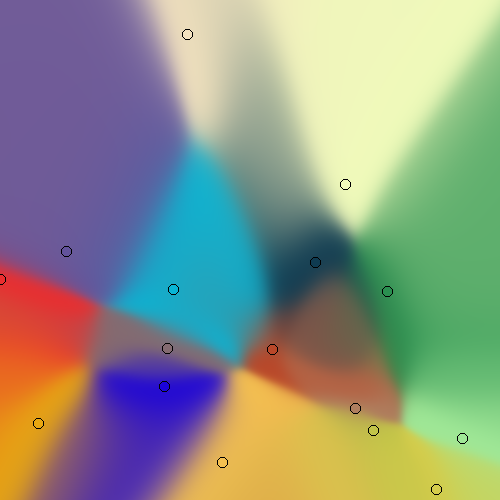

# neurobiba

[](https://pypi.org/project/neurobiba/)


other languages:

- [RU](./README.ru.md)

small collection of functions for neural networks.

very easy to use!

Installation:

```
pip install neurobiba
```

See [examples](./examples)



# how to use

1. create weights

```python
weights = Weights([2, 1]) # 2 input neurons and 1 output
```

2. create data, create answer, train

```python
for i in range(10000): # train 10000 times
    a, b = random(), random() # a and b is a random numbers
    output = int(a > b) # if a > b then answer is 1, else 0
    weights.train([a, b], [output]) # train
```

3. enjoy

```python
result = weights.feed_forward([0.1, 0.3])[0] # result is close to 0
```
